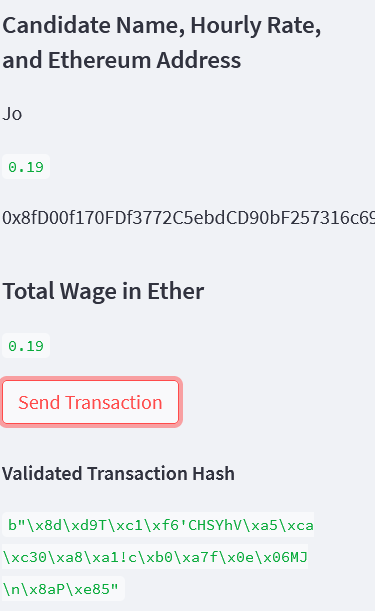
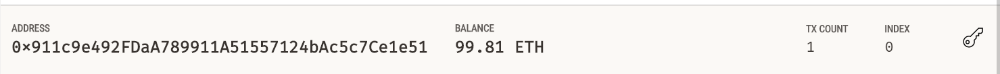
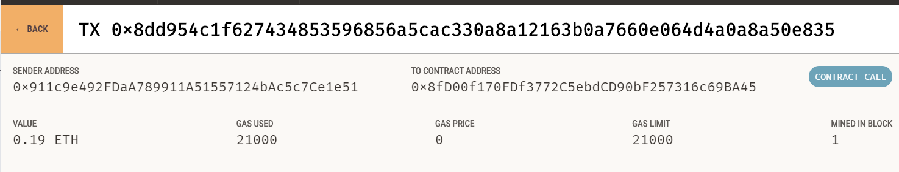

# 19-blockchain-wallets

## Screenshots and Comments
* First we send a transaction to Jo at the approriate address and see that a validated transaction hash was returned

* We further confirm this by looking at the accounts tab in Ganache and see that the starting account balance of 100 ETH has decreased to 99.81 ETH. Additionally, the TX count has increased to 1.

* Then we locate the transaction in Ganache transactions tab and can see the addresses correspond to what we expected to see and so does the amount.
